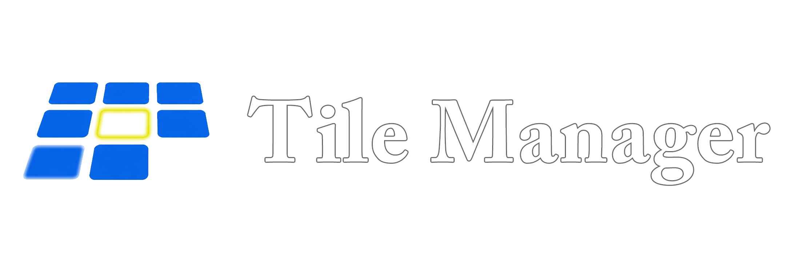

<p align="center">
  
</p>

<br>

<p align="center">
  
</p>

A JSON-driven static homepage generator. Edit tiles in a drag-and-drop admin panel, export `tiles.json`, and deploy a pre-rendered site to Cloudflare Pages in one build step.

## How it works

- **Local preview** — open any page in `site/` via Live Server. `app.js` fetches `tiles.json` and `site.json` at runtime and hydrates whatever comment tags exist in the page. No build step needed.
- **Production build** — `npm run build` processes all `*.html` files in `site/`, substitutes `{{SITE_*}}` tokens from `site.json`, pre-renders tiles and filters from `tiles.json`, and writes everything to `dist/`. The `app.js` script tag is stripped from the output.
- **Deploy** — point Cloudflare Pages at the repo with build command `npm run build` and output directory `dist`.

## Project structure

```
core/               ← build engine — safe to pull upstream updates
  build.js          ← reads site/, writes dist/
  app.js            ← local preview hydration (tiles + site.json tokens)
  admin.js          ← admin panel logic
  admin.css         ← admin panel styles
  admin.html        ← admin panel UI

site/               ← your customizations — never touched by core updates
  index.html        ← template + local preview entry point
  site.json         ← site metadata (title, logo, footer, etc.)
  tiles.json        ← statuses, sections, and tile data
  style.css         ← public site styles
  images/           ← logo, og image, tile images
  source/           ← original source files (not served, not built)
    tiles/          ← drop source images here, run convert-tiles.bat

dist/               ← gitignored build output (generated by npm run build)
```

## Getting started

1. **Clone the repo**
2. Edit `site/site.json` with your site details
3. Open `site/index.html` with [Live Server](https://marketplace.visualstudio.com/items?itemName=ritwickdey.LiveServer) to preview locally
4. Open `core/admin.html` via Live Server to manage tiles — use **Import JSON** to load your `tiles.json`, then **Export JSON** when done
5. Push to GitHub and connect to Cloudflare Pages

## site.json tokens

Tokens in any `site/*.html` file are substituted at build time and resolved at runtime during local preview.

| Token | Field |
|---|---|
| `{{SITE_TITLE}}` | `title` |
| `{{SITE_DESCRIPTION}}` | `description` |
| `{{SITE_TAGLINE}}` | `tagline` |
| `{{SITE_URL}}` | `url` |
| `{{SITE_LOGO}}` | `logo` |
| `{{SITE_OG}}` | `og` |
| `{{SITE_ICON}}` | `icon` |
| `{{SITE_FOOTER}}` | `footer` (supports HTML) |

## Section tags

HTML comment tags control where content is injected. Place them anywhere in any `site/*.html` file — all are optional and silently skipped if absent.

| Tag | Output |
|---|---|
| `<!--FILTERS-->` | Status filter buttons |
| `<!--SECTIONS-->` | All visible non-featured sections |
| `<!--FEATURED-->` | The featured section (tiles sorted by featured order) |
| `<!--SECTION:ID-->` | One specific section by its ID |

This lets you build multi-page sites — place different section tags on different HTML files and each page gets exactly the content you want. `app.js` handles the same tags at runtime for local preview, so it works file-independently on any page in `site/`.

## tiles.json structure

```json
{
  "statuses": [
    { "id": "active", "label": "ACTIVE", "color": "#39ff84" }
  ],
  "sections": [
    { "id": "1", "title": "PICKS", "featured": true },
    { "id": "2", "title": "TOOLS" },
    { "id": "3", "title": "ARCHIVED", "visible": false }
  ],
  "tiles": [
    {
      "id": "1", "section": "2",
      "cat": "CATEGORY", "name": "TILE NAME",
      "desc": "Description text.",
      "status": "active",
      "domain": "example.com",
      "href": "https://example.com",
      "image": "example.webp",
      "featured": 1,
      "visible": false
    }
  ]
}
```

### Section fields

| Field | Type | Description |
|---|---|---|
| `id` | string | Sequential number assigned on export — controls display order, not a permanent identifier |
| `title` | string | Display name — shown on the public site and in the admin |
| `visible` | boolean | `false` hides the section from the built site; omit or `true` to show |
| `featured` | boolean | Designates this as the one featured section — its tiles are sourced by `featured` order, not by section assignment |

### Tile fields

| Field | Type | Description |
|---|---|---|
| `id` | string | Sequential number assigned on export — controls display order, not a permanent identifier |
| `section` | string | ID of the section this tile belongs to |
| `cat` | string | Category label shown above the tile name |
| `name` | string | Tile title |
| `desc` | string | Short description |
| `status` | string | ID of a status from the `statuses` array |
| `domain` | string | Domain shown at the bottom of the tile; also used for the favicon |
| `href` | string | Link URL — omit to render the tile as a non-clickable div |
| `image` | string | Full filename including extension in `site/images/tiles/` (e.g. `mytile.webp`) |
| `showImage` | boolean | `true` renders the image area — real image if `image` is set, gradient placeholder if not. Default `false` (compact tile). Toggled via the thumbnail in the admin. |
| `expand` | boolean | `true` makes the tile standalone — never stacks, gradient suppressed, fills available row height. Use for text-heavy tiles. Ignored on tiles with a real image. Default `false`. |
| `visible` | boolean | `false` hides the tile from the built site and local preview |
| `featured` | number | Position in the featured section (1 = first). Omit or `0` to exclude from featured. |
| `audio` | string | Relative path (e.g. `audio/track.mp3`) or full URL to an audio file. Renders an inline player on the tile. |

Statuses are user-defined colored classifiers — add, edit, and delete them from the **Statuses** tab in the admin panel. The filter bar on the public site is generated from whatever statuses exist in `tiles.json`.

## Tile images

Drop images into `site/images/tiles/` and reference them by full filename including extension in the tile's `image` field. Any format works — `.webp`, `.jpg`, `.gif`, `.png`.

Set `showImage: true` on the tile (or click the thumbnail in the admin) to display the image. If the file is missing, a gradient placeholder shows instead so you can see the slot is reserved. If the file loads, it covers the gradient automatically.

**Converting source images:** drop your original files into `site/source/tiles/` and run `convert-tiles.bat`. It uses [ImageMagick](https://imagemagick.org/) to convert and resize them to 900px wide WebP, outputting directly into `site/images/tiles/`.

## Tile layout

By default tiles are compact (no image area) and eligible for stacking. Two consecutive compact tiles in a section are automatically grouped into a single grid cell, splitting the height equally. This keeps the grid balanced when mixing image and non-image tiles.

Three layout modes per tile:

| Mode | How | Result |
|---|---|---|
| Compact (default) | `showImage` off, `expand` off | Small tile, stacks with the next compact tile |
| Image / gradient | `showImage` on | Full-height tile with image or gradient placeholder |
| Expand | `expand` on | Full-height tile, no image area, no stacking — description fills the space |

On mobile (single column) stacking is disabled and all tiles flow normally.

## Audio tiles

Set the `audio` field on any tile to a relative path or URL pointing to an audio file. The tile renders an inline player: play/pause, a scrubber bar with a handle dot, a timestamp, and a mute button.

**Compact tile:** player bar sits above the category label.
**Image tile:** slim frosted bar overlaid at the bottom of the image (click the image to play/pause).

Only one track plays at a time — starting a new tile pauses whatever was playing. When a track finishes it auto-advances to the next audio tile in DOM order and stops at the last one.

## Admin panel

Open `core/admin.html` directly via Live Server (or `dist/admin.html` after a build). The admin panel saves state to `localStorage` under the key `tile_manager_admin`. Use **Export JSON** to download `tiles.json` or **Copy JSON** to copy it to the clipboard — useful on mobile for pasting directly into the GitHub app.

The admin has three tabs:
- **Tiles** — add, edit, delete, and drag-to-reorder tiles within a section. Each row has a favicon thumbnail (click to toggle `showImage`), a star (☆/★) to feature/unfeature, and a hide/show toggle. The tile edit modal includes an **Expand** checkbox. The **SHOW HIDDEN** toolbar button reveals tiles from hidden sections in the all-sections view.
- **Sections** — add, edit, delete, and drag-to-reorder sections. Each section has a hide/show toggle. The featured section shows a badge and cannot be deleted — it can only be renamed or hidden.
- **Statuses** — add, edit, and delete status labels with custom colors; deleting a status that is still in use shows an error.

### Visibility

Both tiles and sections support a `visible` field. Hidden items are excluded from the built site and local preview but remain fully editable in the admin. Hidden rows are visually dimmed with an orange left border and a strikethrough on the name.

### Featured section

One section in `tiles.json` carries `"featured": true` — this designates it as the featured section. It can be renamed and hidden like any other section, but not deleted. The default `tiles.json` ships with a section called **PICKS** as the featured section.

The featured section ignores its own tile assignments and instead displays all tiles that have a `featured` order number, sorted by that number. To feature a tile, click the ☆ in the admin — it becomes ★ and is assigned the next available position. To reorder, select the featured section from the section dropdown and drag tiles into the desired order.

## Cloudflare Pages settings

| Setting | Value |
|---|---|
| Build command | `npm run build` |
| Build output directory | `dist` |
| Node.js version | 18+ |
